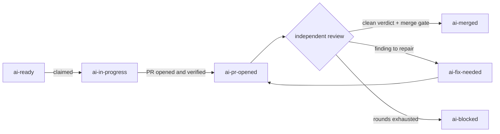

Every delivery is recorded entirely inside your GitHub repository. An Issue moves through a sequence of `ai-*` labels, from `ai-ready` to `ai-merged`, and each transition leaves a comment, a PR, or a branch as evidence. There is no separate dashboard to check — the labels, comments, and pull request in your repository are the delivery record.

## The State Machine

The diagram below shows every state an Issue can reach and what triggers each transition.

## What Each Label Means

Orbi sets and clears these labels automatically as work progresses.

| Label | Meaning |
|---|---|
| `ai-ready` | Dispatched to Orbi; claimed on the next pickup tick |
| `ai-in-progress` | Running: a workspace exists and code is being written |
| `ai-pr-opened` | PR is open and verified, awaiting independent review |
| `ai-fix-needed` | Review found issues; resumes on the next tick |
| `ai-merged` | Success — the reviewed commit was merged to your base branch |
| `ai-blocked` | Stopped; automatic recovery is not safe — a person must decide |
| `ai-awaiting-merge` | PR is delivered and waiting for a maintainer to approve and merge |

Two labels are set by people, never by Orbi:

| Label | When you set it |
|---|---|
| `ai-release` | Pair with `ai-ready` to start a release |
| `ai-human-review` | Set to record that you have confirmed manual review of a PR |

## Timing

Pickup runs on a timer rather than responding to events instantly, so allow up to 5 minutes between adding a label and seeing the next state. The same tick interval applies to every transition — `ai-fix-needed` resuming to `ai-pr-opened`, for example, takes the same time as initial pickup.

Delivery time beyond that first transition depends entirely on the size and complexity of the task. The status page at [orbi.build/api/](https://orbi.build/api/) shows runtime, model request count, and resumption count for each work item so you can see how much has happened.

## The Independent Review

After the coding session opens a PR, a completely separate AI session reads the diff from scratch. That reviewing session did not write the code and has no memory of the coding session — it only sees what a human reviewer would see.

The reviewer runs the tests again and either returns a clean verdict or files specific findings. If findings are filed, a repair round begins and the loop repeats. The number of repair rounds is bounded. If the rounds are exhausted before a clean verdict is reached, the Issue is marked `ai-blocked` and the PR, branch, and workspace are all preserved exactly as they are.

Only a clean verdict passes through the merge gate. Orbi merges the exact commit that was reviewed — no additional changes are made between the verdict and the merge.

## Steering a Running Delivery

While the `ai-in-progress` label is present, you can redirect the work without waiting for the session to finish.

To steer, add a comment to the Issue or edit the Issue body with your correction. Orbi detects the change and restarts the coding session with your updated instructions within approximately 1 minute.

Two limits apply:

- Each delivery supports a maximum of **3 steering restarts**. After that, let the current session finish and put your revised scope in a follow-up Issue.
- Only repository owners, maintainers, members, and collaborators can trigger a restart. This prevents anyone with public comment access from redirecting a running session.

## `ai-blocked` Is a Decision Point

`ai-blocked` is a terminal state. Orbi has stopped and is waiting for a human to decide what happens next. The comment Orbi leaves on the Issue explains exactly why automatic recovery was not possible.

You have three options:

- **Change the code directly** on the PR branch, then re-apply `ai-ready` once the underlying problem is resolved.
- **Rewrite the acceptance criteria** in the Issue body if the original description was ambiguous or incorrect, then re-apply `ai-ready`.
- **Close the ticket** if the work is no longer needed or the scope needs to be redesigned from scratch.

<Warning>
  Removing the `ai-blocked` label alone does not restart anything. Fix the underlying cause first — then re-apply `ai-ready` to queue the Issue for a fresh pickup.
</Warning>

For step-by-step recovery guidance, see [Recovering from ai-blocked](/troubleshooting#ai-blocked).
