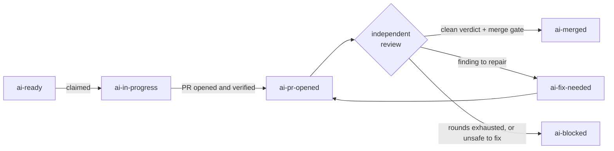

An Issue moves through the `ai-*` labels from `ai-ready` to `ai-merged`, and the labels themselves are the delivery record.

Orbi Cloud keeps no separate dashboard of truth. The labels on your Issue, the comments Orbi leaves, and the pull request it opens are the complete state of a delivery — which means you can read, audit and correct everything from GitHub alone.

## The state machine

## What each label means

The right-hand column is the chip the status page shows for that label in **Delivery history**.

| Label | Meaning | Status page chip |
|---|---|---|
| `ai-ready` | You dispatched this Issue to Orbi. It may be claimed on the next tick. | **Queued** |
| `ai-in-progress` | Claimed and running: a workspace exists and a session is writing code. | **In progress** |
| `ai-pr-opened` | The pull request is open and verified, awaiting the independent review. | **PR under review** |
| `ai-fix-needed` | The review found something, or the head is not mergeable yet. The next tick resumes the same run, branch and pull request. | **Fix needed** |
| `ai-merged` | Success. The reviewed commit was merged and the merge confirmed on your base branch. | **Merged** |
| `ai-blocked` | Stopped on purpose. Automatic recovery is not safe, and a person has to decide the next step. | **Blocked** |
| `ai-awaiting-merge` | The reviewed pull request is delivered and waiting for a maintainer to approve and merge it — usually because branch protection requires an approval. | **Awaiting approval** |
| `ai-needs-detail` | Orbi could not proceed without more information from you. The comment on the Issue says what is missing; answer it there. | **Needs detail** |

A closed Issue shows **Closed**.

Two labels are set by people, never by Orbi:

| Label | Who sets it | Status page chip |
|---|---|---|
| `ai-release` | You, to start a release. See [releases](/releases). | — |
| `ai-human-review` | You, to record that a person confirmed the delivery checklist. Orbi never adds or removes it. | **Needs your confirmation** |

Anything waiting on you — **Blocked**, **Awaiting approval**, **Needs detail**, **Needs your confirmation** — is also pulled to the top of the status page, under **① Needs you** in the **Next** card.

## Timing

Orbi works on a timer rather than reacting instantly, so **pickup takes up to five minutes** after you add `ai-ready`. The same tick interval applies to every transition: a delivery that needs a repair round waits for the next tick before resuming.

How long a delivery takes after pickup depends entirely on the size of the task. A small, well-specified change can finish in minutes; a large one takes longer and may go through several repair rounds. The status page shows runtime, model requests, tokens and cache use per work item in **Delivery history** once a delivery reports usage.

## The independent review

The session that reviews the pull request is **not** the session that wrote it. It reads the diff fresh, runs the tests again, and either returns a clean verdict or files findings.

When it files findings, Orbi repairs them and the pull request goes back for another round. This loop is bounded: if rounds are exhausted without reaching a clean verdict, the Issue is marked `ai-blocked` rather than looping forever. The pull request, branch and workspace all stay intact when that happens, so nothing is lost.

Only a clean verdict reaches the merge gate, and the merge is of the **exact commit that was reviewed** — not a rebuilt or rebased version of it.

## Steering a delivery that is already running

You do not have to wait for a delivery to finish to correct it. While an Issue is `ai-in-progress`, add a comment with the new decision, or edit the Issue body. Both channels are equivalent, and the running session restarts with your correction — normally within a minute.

This is the intended way to redirect work that is going the wrong way; you do not need to cancel anything.

Two limits are worth knowing:

**Steering is bounded.** A delivery accepts **3 steering restarts** by default. After that, further corrections do not restart it — let the delivery finish and put the revised scope into a follow-up Issue.

**Only trusted commenters can steer.** Comments from the repository's owner, maintainers, members and collaborators steer a run; a comment from an arbitrary public commenter is ignored by design, because otherwise anyone who can comment on your Issue could redirect what the agent does.

## `ai-blocked` is a decision point, not a failure

`ai-blocked` is a terminal state that means a human must decide what happens next. The comment Orbi leaves on the Issue states why automatic recovery was not possible.

"Decide the next step" genuinely means any next step: change the code, rewrite the Issue's acceptance criteria, or close the ticket. **Removing the label alone does not restart anything** — fix the underlying problem first, then re-apply `ai-ready` to put the Issue back in the queue.

See [troubleshooting](/troubleshooting#ai-blocked) for how to read a blocked comment.

## Sharing a delivery

When a delivery merges, Orbi comments on the pull request with a **Delivery proof** link — a page at `orbi.build/proof/<owner>/<repo>/<issue>` that shows the Issue, the pull request, the review and, once it ships, the version it was **Released in**.

The page has **Copy link** and **Share on X** buttons. For a public repository anyone with the link can open it; for a private repository it only opens for someone who signs in with a GitHub account that can read that repository, so sharing the link does not expose private code.

## Task types

`ai-ready` is the execution switch for every kind of task. A second label chooses which playbook runs:

| Task type | Labels | What you get |
|---|---|---|
| Development (the default) | `ai-ready` | The full chain: workspace, tests, one pull request, independent review, merge |
| Release | `ai-ready` + `ai-release` | The deterministic release state machine — tag and GitHub Release. See [releases](/releases) |
| Ops / research | `ai-ready` + `ai-ops-only` | A full execution session running the ops playbook; the deliverable is the evidence posted on the Issue. If it commits code, that code still takes the normal pull request route |
| Content | `ai-ready` + `ai-content-only` | Text in, text out, delivered as an Issue comment — no execution and no git. The Issue is closed after delivery |

One more label affects ordering rather than behaviour: `p0` marks an Issue urgent, and Orbi picks up `p0`-labelled Issues before bug-labelled ones, which come before plain ones.

<Note>
This page describes the lifecycle as you experience it on Cloud. The engine's own reference — every transition, the exact resume semantics, and the full config surface — is at [docs.orbi.build/workflow](https://docs.orbi.build/workflow).
</Note>
