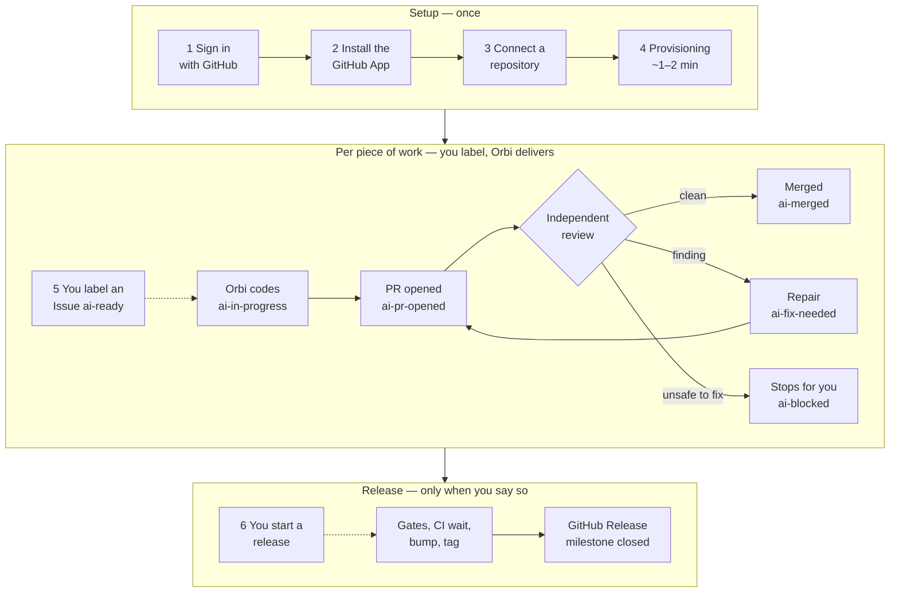
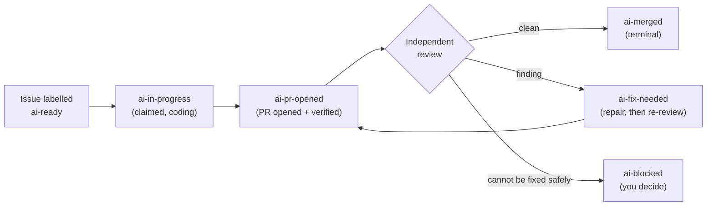

Orbi Cloud is a hosted runner that turns a labelled GitHub Issue into a tested, independently reviewed, merged pull request — on infrastructure Orbi operates.

You keep working in GitHub. You file an Issue in your own repository and add the `ai-ready` label; Orbi Cloud claims it, writes the code in an isolated workspace, runs your test suite, opens a pull request, reviews that pull request in a separate session, repairs what the review finds, and merges the exact reviewed commit. The Issues, the pull requests and the release evidence all stay in your repository. There is no second workspace to adopt and no new password.

Orbi Cloud runs the same delivery engine as self-hosted [Orbi](https://orbi.build/?ref=cloud-docs-index), which is open source. The difference is who operates the runner: with Cloud, Orbi does.

## The whole path, end to end

Everything below the dashed line is automatic. Your part is the four steps of setup, then one label per piece of work — and the decision to cut a release.

The two dotted arrows are the only two switches you throw: the `ai-ready` label, and the release. Orbi never throws either one for you.

The status page walks you through the same path. Its **Setup progress** list has seven steps — the six above plus **Subscribe** — and marks the one that is waiting on you.

## What you actually do

<CardGroup>
  <Card title="Sign in with GitHub" href="/sign-in">
    One OAuth click. Your GitHub account is your Orbi identity — there is no separate credential.
  </Card>
  <Card title="Install the GitHub App" href="/install-app">
    You choose which repositories the runner may work in, and you can revoke it from GitHub at any time.
  </Card>
  <Card title="Connect a repository" href="/connect-repository">
    Pick the repository and its base branch. Orbi provisions a runner for it, usually in one to two minutes.
  </Card>
  <Card title="Label an Issue `ai-ready`" href="/first-issue">
    That label is the execution switch. Not sure what to try first? The status page can create a small starter Issue for you.
  </Card>
</CardGroup>

## The delivery loop

The review is a separate session that did not write the code. It repairs the findings it can and re-runs the tests; only a clean verdict reaches the merge gate. When automatic recovery is not safe, the Issue lands on `ai-blocked` with a comment saying why — that state is a deliberate stop, waiting for a human decision, not a crash.

Read [the delivery lifecycle](/delivery-lifecycle) for what each label means and what moves an Issue between them.

## What it costs

Your first **3 merged deliveries are free** — no card and no subscription. Failed deliveries do not use up that allowance.

After that there are two paid plans, **Solo** and **Pro**. Both include model usage in the price — Solo with 100,000,000 tokens a month and one repository, Pro with 300,000,000 tokens a month and up to five repositories. There is no per-token overage billing: when the month's allowance runs out, new deliveries pause until the next month, or until you add your own model key.

The current prices, the yearly option and any founding offer are on the [pricing page](https://orbi.build/cloud/?ref=cloud-docs-index). [Billing](/billing) covers how subscribing works, and [limits and quotas](/limits-and-quotas) covers how the allowance is counted.

## What Orbi Cloud does not do

It does not discover repositories on its own — it only ever works in the repositories you connect. It does not start a release on its own; the release Issue carries the `ai-release` label, which only a human can set. It does not push to your protected branches outside of the reviewed merge, and it does not touch a delivery that is already running when the platform is upgraded.

Read [security](/security) for the full boundary list, including where your model key is stored and what the runner can reach.

## Where to go next

If you want the shortest path to a merged pull request, start with the [quickstart](/quickstart). If something is already wrong, go to [troubleshooting](/troubleshooting).

## The engine's own documentation

These pages cover Orbi Cloud — the hosted product. The delivery engine underneath is open source and documented separately at **[docs.orbi.build](https://docs.orbi.build)**. Go there when you want the mechanism rather than the product:

<CardGroup>
  <Card title="The delivery workflow in depth" href="https://docs.orbi.build/workflow">
    The full label state machine, the review and repair loop, steering, and the release state machine — the engine's own reference for everything Cloud runs on your behalf.
  </Card>
  <Card title="The engine's security boundaries" href="https://docs.orbi.build/security">
    What the engine will and will not do: what it never pushes to, what it never merges, and why.
  </Card>
  <Card title="Run it yourself instead" href="https://docs.orbi.build/quickstart">
    Self-hosting is free and stays free. Same engine, you operate the runner.
  </Card>
</CardGroup>
