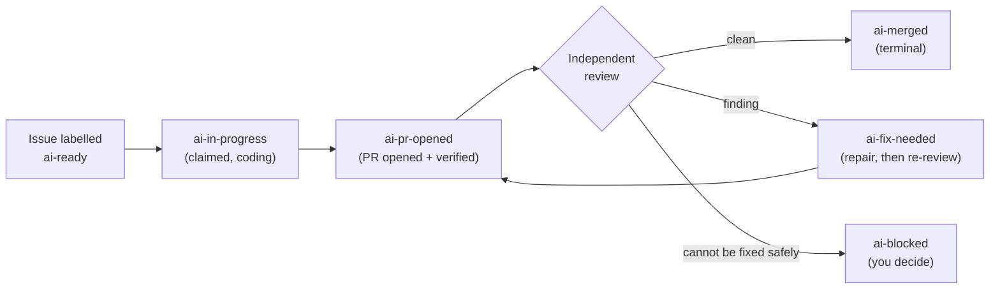

# Orbi Cloud

Orbi Cloud is a hosted runner that turns a labelled GitHub Issue into a tested, independently reviewed, merged pull request — on infrastructure Orbi operates.

You keep working in GitHub. You file an Issue in your own repository and add the `ai-ready` label; Orbi Cloud claims it, writes the code in an isolated workspace, runs your test suite, opens a pull request, reviews that pull request in a separate session, repairs what the review finds, and merges the exact reviewed commit. The Issues, the pull requests and the release evidence all stay in your repository. There is no second workspace to adopt and no new password.

Orbi Cloud runs the same delivery engine as self-hosted [Orbi](https://orbi.build/?ref=cloud-docs-index), which is open source. The difference is who operates the runner: with Cloud, Orbi does.

## What you actually do

<CardGroup>
  <Card title="Sign in with GitHub" href="/sign-in">
    One OAuth click. Your GitHub account is your Orbi identity — there is no separate credential.
  </Card>
  <Card title="Install the GitHub App" href="/install-app">
    You choose which repositories the runner may work in, and you can revoke it from GitHub at any time.
  </Card>
  <Card title="Connect one repository" href="/connect-repository">
    Pick the repository and its base branch. Orbi provisions a runner for it, usually in about a minute.
  </Card>
  <Card title="Label an Issue `ai-ready`" href="/first-issue">
    That label is the execution switch. Everything after it is automatic until a pull request is waiting for you.
  </Card>
</CardGroup>

## The delivery loop

The review is a separate session that did not write the code. It repairs the findings it can and re-runs the tests; only a clean verdict reaches the merge gate. When automatic recovery is not safe, the Issue lands on `ai-blocked` with a comment saying why — that state is a deliberate stop, waiting for a human decision, not a crash.

Read [the delivery lifecycle](/delivery-lifecycle) for what each label means and what moves an Issue between them.

## What it costs

Your first **3 merged deliveries are free** — no card and no subscription. Failed deliveries do not use up that allowance. After it, Orbi Cloud is **US$79 per month**, which includes **300,000,000 tokens of model usage per month**. There is no per-token overage billing: when the monthly allowance runs out, new deliveries pause until the next calendar month.

See [limits and quotas](/limits-and-quotas) for how the allowance is counted and what happens at the cap.

## What Orbi Cloud does not do

It does not discover repositories on its own — it only ever works in the one repository you connect. It does not start a release on its own; you open the release Issue and apply the `ai-release` label, which only a human can set. It does not push to your protected branches outside of the reviewed merge, and it does not touch a delivery that is already running when the platform is upgraded.

Read [security](/security) for the full boundary list, including where your model key is stored and what the runner can reach.

<Note>
Orbi Cloud is in Private Beta. One repository can be connected at a time, and the walkthrough here reflects the product as it currently ships — not a roadmap.
</Note>

## Where to go next

If you want the shortest path to a merged pull request, start with the [quickstart](/quickstart). If something is already wrong, go to [troubleshooting](/troubleshooting).
