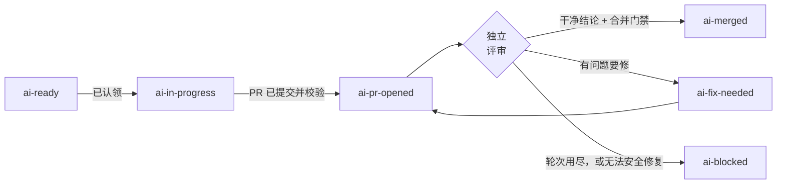

一张 Issue 沿着 `ai-*` 标签从 `ai-ready` 走到 `ai-merged`，而这些标签本身就是交付记录。

Orbi Cloud 不另外维护一份「真相面板」。你 Issue 上的标签、Orbi 留下的评论、它提交的 pull request，就是一次交付的全部状态 —— 这意味着你只靠 GitHub 就能读取、审计和纠正所有东西。

## 状态机

## 每个标签的含义

| 标签 | 含义 |
|---|---|
| `ai-ready` | 你把这张 Issue 派给了 Orbi。下一个 tick 就可能被认领。 |
| `ai-in-progress` | 已认领并正在跑：工作区已建好，有一个会话在写代码。 |
| `ai-pr-opened` | pull request 已提交并通过校验，等独立评审。 |
| `ai-fix-needed` | 评审发现了问题，或者 head 还不可合并。下一个 tick 会接着同一个 run、同一个分支、同一个 pull request 继续。 |
| `ai-merged` | 成功。评审过的那个 commit 已合并，并在你的基础分支上确认。 |
| `ai-blocked` | 有意的停止。自动恢复不安全，需要一个人来决定下一步。 |
| `ai-awaiting-merge` | 评审过的 pull request 已交付，等一位 maintainer 批准并合并。 |

有两个标签只由人来打，Orbi 从不打：

| 标签 | 谁来打 |
|---|---|
| `ai-release` | 你，用来启动一次发版。见[发版](/zh/releases)。 |
| `ai-human-review` | 你，用来记录有人确认过交付检查清单。Orbi 从不添加或移除它。 |

## 时间

Orbi 按定时器工作，不是即时反应，所以你加上 `ai-ready` 之后**认领最多要五分钟**。同样的 tick 间隔适用于每一次状态转移：修复中轮次的交付要等下一个 tick 才继续。

认领之后一次交付要跑多久，完全取决于任务的大小。一个小而清晰的改动几分钟就能完成；大的要更久，还可能经过好几轮修复。一旦交付上报了用量，状态页会按工作项显示运行时长、模型请求数和重启次数。

## 独立评审

评审 pull request 的那个会话**不是**写它的那个会话。它从头读 diff，重新跑测试，然后要么给出干净结论，要么提交发现的问题。

提交了问题之后，Orbi 修掉它们，pull request 再进下一轮。这个循环是有界的：如果轮次用尽仍然没拿到干净结论，Issue 会被标成 `ai-blocked`，而不是无限循环下去。发生这种情况时 pull request、分支和工作区全部保留，什么都不会丢。

只有干净结论才能进入合并门禁，而合并的是**被评审的那个 commit 本身** —— 不是重建或 rebase 过的版本。

## 让正在跑的交付转向

你不用等一次交付跑完才能纠正它。Issue 处于 `ai-in-progress` 时，加一条写着新决定的评论，或者改 Issue 正文。两条通道等价，正在跑的会话会带着你的纠正重启 —— 通常一分钟内。

这就是给跑偏的工作重新定向的正规做法，你不需要取消任何东西。

有两个限制值得知道：

**转向是有界的。** 一次交付默认接受 **3 次转向重启**。超过之后，后续的纠正不会再重启它 —— 让这次交付跑完，把修订后的范围放进一张后续 Issue。

**只有可信的评论者能让它转向。** 来自仓库 owner、maintainer、成员和协作者的评论能让一个 run 转向；来自任意公众评论者的评论按设计被忽略，否则任何能在你 Issue 下评论的人都能改变 agent 在做什么。

## `ai-blocked` 是决策点，不是失败

`ai-blocked` 是一个终态，意思是必须由人决定接下来怎么办。Orbi 在 Issue 上留下的评论会说明为什么自动恢复做不到。

「决定下一步」真的是指任何下一步：改代码、重写 Issue 的验收标准，或者直接关票。**只摘掉标签不会重启任何东西** —— 先修掉根本问题，再重新打上 `ai-ready` 把 Issue 放回队列。

怎么读一条 blocked 评论，见[问题排查](/zh/troubleshooting)。

## 任务类型

`ai-ready` 是所有类型任务的执行开关。第二个标签决定跑哪套 playbook：

| 任务类型 | 标签 | 你会得到什么 |
|---|---|---|
| 开发（默认） | `ai-ready` | 完整链路：工作区、测试、一个 pull request、独立评审、合并 |
| 发版 | `ai-ready` + `ai-release` | 确定性的发版状态机 —— 打 tag 和 GitHub Release。见[发版](/zh/releases) |
| 运维 / 调研 | `ai-ready` + `ai-ops-only` | 一个完整的执行会话跑运维 playbook；交付物是发在 Issue 上的证据。如果它提交了代码，那些代码照样走正常的 pull request 路径 |
| 内容 | `ai-ready` + `ai-content-only` | 文字进、文字出，以 Issue 评论的形式交付 —— 不执行、不碰 git。交付之后 Issue 会被关闭 |

还有一个标签影响的是顺序而不是行为：`p0` 把一张 Issue 标为紧急，Orbi 认领打了 `p0` 的 Issue 优先于打了 bug 标签的，后者又优先于没打标的。

<Note>
这一页讲的是你在 Cloud 上看到的生命周期。引擎自己的参考 —— 每一次状态转移、接续（resume）的确切语义、完整的配置面 —— 在 [docs.orbi.build/zh/workflow](https://docs.orbi.build/zh/workflow)。
</Note>
