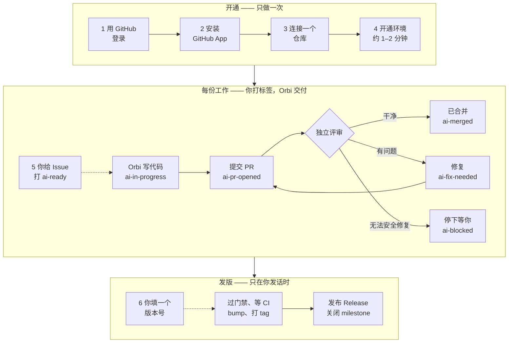
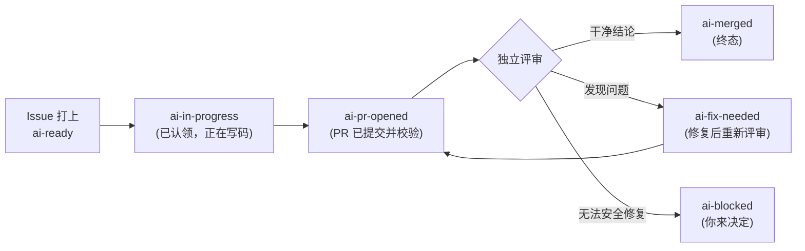

Orbi Cloud 是一个托管 runner，把打上标签的 GitHub Issue 变成经过测试、独立评审、已合并的拉取请求 —— 跑在 Orbi 运维的基础设施上。

你继续在 GitHub 里工作。你在自己的仓库建一张 Issue、打上 `ai-ready` 标签；Orbi Cloud 认领它，在隔离的工作区写代码，跑你的测试套件，提交拉取请求，再用另一个会话评审这个 PR，修掉评审发现的问题，然后合并**评审过的那个 commit**。Issue、PR 和发版证据全部留在你的仓库里。没有第二套工作台要适应，也没有新密码要记。

Orbi Cloud 跑的是和自托管 [Orbi](https://orbi.build/?ref=cloud-docs-index) 同一套交付引擎，引擎是开源的。区别只在于谁来运维 runner：用 Cloud，Orbi 来运维。

## 全流程

虚线箭头之后的部分全是自动的。你要做的是四步开通，然后每份工作打一个标签 —— 以及决定什么时候发版。

两条虚线箭头就是你要扳的两个开关：`ai-ready` 标签，和版本号。这两个 Orbi 都不会替你扳。

## 你实际要做的事

<CardGroup>
  <Card title="用 GitHub 登录" href="/zh/sign-in">
    一次 OAuth 点击。你的 GitHub 账号就是你的 Orbi 身份 —— 没有单独的凭据。
  </Card>
  <Card title="安装 GitHub App" href="/zh/install-app">
    你来选 runner 可以在哪些仓库里工作，随时可以在 GitHub 上撤销。
  </Card>
  <Card title="连接一个仓库" href="/zh/connect-repository">
    选好仓库和基础分支。Orbi 为它开通运行环境，通常一分钟左右。
  </Card>
  <Card title="给 Issue 打 `ai-ready`" href="/zh/first-issue">
    这个标签就是执行开关。打上之后一路自动，直到有一个 PR 等着你评审。
  </Card>
</CardGroup>

## 交付循环

评审由一个**没有写过这份代码**的会话执行。它修掉自己能修的问题并重跑测试；只有结论干净的 PR 才能进入合并门禁。当自动恢复不安全时，Issue 会落到 `ai-blocked` 并附一条说明原因的评论 —— 这个状态是**有意的停止**，在等一个人的决定，不是崩溃。

每个标签的含义、以及什么会让 Issue 在它们之间移动，见[交付生命周期](/zh/delivery-lifecycle)。

## 价格

前 **3 次合并的交付免费** —— 不用绑卡，不用订阅。失败的交付不消耗这个额度。之后是 **79 美元/月**，含 **每月 3 亿（300,000,000）tokens 的模型用量**。没有按 token 的超额计费：额度用完时，新的交付暂停，直到下一个自然月。

额度怎么计、到顶之后会发生什么，见[额度与限制](/zh/limits-and-quotas)。

## Orbi Cloud 不做的事

它不会自己去发现仓库 —— 只在你连接的那一个仓库里工作。它不会自己发版；发版要你开一张 release Issue 并打上 `ai-release` 标签，这个标签只有人能打。除了那次经过评审的合并之外，它不会推你的受保护分支；平台升级时，它也不会打断一个正在执行的交付。

完整的边界清单 —— 包括你的模型 key 存在哪、runner 能访问到什么 —— 见[安全](/zh/security)。

<Note>
Orbi Cloud 处于 Private Beta。同一时间只能连接一个仓库，本文描述的是**当前已经上线**的产品形态，不是路线图。
</Note>

## 接下来读什么

想用最短路径拿到一个合并的 PR，从[快速开始](/zh/quickstart)。如果已经出问题了，去[问题排查](/zh/troubleshooting)。

## 引擎自己的文档

这些页面讲的是 Orbi Cloud —— 托管产品。底下那套交付引擎是开源的，文档在 **[docs.orbi.build](https://docs.orbi.build/zh)**。想看机制而不是产品时去那边：

<CardGroup>
  <Card title="交付流程的完整机制" href="https://docs.orbi.build/zh/workflow">
    完整的标签状态机、评审与修复循环、转向、发版状态机 —— Cloud 替你跑的这一切，引擎侧的原始参考。
  </Card>
  <Card title="引擎的安全边界" href="https://docs.orbi.build/zh/security">
    引擎会做什么、不会做什么：它永远不推哪里、永远不合并什么，以及为什么。
  </Card>
  <Card title="改成自己跑" href="https://docs.orbi.build/zh/quickstart">
    自托管免费，并且一直免费。同一套引擎，runner 由你运维。
  </Card>
</CardGroup>
